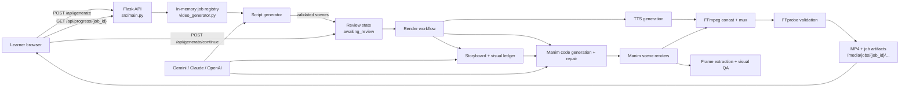
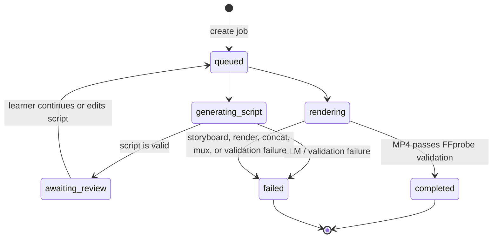

# Prompt2Learn.ai — High-Level Design

## 1. Purpose

Prompt2Learn.ai (P2L.ai) converts a learner's topic into a short educational
video. It combines LLM-authored narration and visual direction, Manim-rendered
scene animations, optional text-to-speech narration, FFmpeg assembly, and
post-render visual quality checks.

The design prioritises educational clarity and visual variety over the fastest
possible generation. Every scene is planned and rendered as an independent
artifact so failures are diagnosable and repairable without losing the full job.

## 2. Scope and constraints

### In scope

- Topic-to-video generation for roughly 60–120 second educational videos.
- Gemini, Claude, or OpenAI for script and animation generation.
- Edge TTS or OpenAI TTS narration.
- Manim Community Edition rendering and FFmpeg/FFprobe media assembly.
- Storyboard-driven visual variety, domain-specific guidance, and visual QA.

### Deliberate constraints

- Flask job state is held in memory; restarting the process loses active job
  status (generated files remain on disk).
- The server disables Flask auto-reload to avoid losing that in-memory state.
- Explicit model selections are strict by default: the job will not silently
  switch models or providers.
- Generated animation code is treated as untrusted output and is compiled in a
  per-scene workspace, with bounded repair attempts.
- FFmpeg and FFprobe must be available on `PATH`; Manim system dependencies are
  required for rendering.

## 3. Architecture



## 4. Main components

| Component | Responsibility |
| --- | --- |
| `src/main.py` | Flask routes, static frontend delivery, media delivery, and stale-build health reporting. |
| `src/video_generator.py` | Background job orchestration, lifecycle/status updates, cache usage, rendering coordination, cost aggregation, and finalization. |
| `src/config.py` + `src/llm_service.py` | Provider/model selection, strict-mode behavior, retries, cooldowns, concurrency limits, safe errors, and LLM usage recording. |
| `src/animations.py` + `src/schemas.py` | Script prompting, target-duration enforcement, and Pydantic validation of script/scene JSON. |
| `src/storyboard.py` + `src/visual_ledger.py` | Per-scene visual direction, diversity checks, continuity mode, semantic colours, and anti-repetition context. |
| `src/domain_guidance.py` | Closed domain-tag taxonomy and focused subject guidance injected only for relevant scenes. |
| `src/manim_generator.py` + `src/scene_checks.py` | Manim prompt construction, parse/compile repair, and static checks for weak scene motion or destructive rebuild patterns. |
| `src/tts_generator.py` | Narration generation, language detection, provider fallback, caching, and ordered audio concatenation. |
| `src/concat_video.py` + `src/ffmpeg_utils.py` | Scene compilation, stream concat/mux, probe parsing, and output validation. |
| `src/visual_qa.py` | Frame sampling, contact sheets, and advisory checks for blank, static, repetitive, clipped, or text-only visuals. |
| `src/frontend/` | Vanilla HTML/CSS/JS UI for submission, script review, progress/activity feed, output playback, and cost information. |

## 5. Job lifecycle



The UI receives the state through `GET /api/progress/<job_id>`. The activity
feed supports incremental polling via `?since=<sequence>`.

## 6. Generation flow

1. The client submits a topic, duration, LLM preference, and optional TTS
   settings to `POST /api/generate`.
2. A background script worker resolves a canonical model selection, generates
   and validates a scene script, then pauses in `awaiting_review`.
3. The learner approves or edits the scene data through
   `POST /api/generate/continue`.
4. Rendering starts TTS and storyboard generation in parallel because both
   depend only on the approved script.
5. The storyboard establishes scene intent, visual metaphor, composition,
   motion, domain tags, continuity, and anti-repetition constraints.
6. Each scene receives focused context: narration, audio duration (when
   available), storyboard entry, prior-scene summary, visual ledger, and only
   applicable domain guidance. It produces Manim source and renders to a
   private directory.
7. The workflow can render independent scenes concurrently while preserving
   their original order for concatenation.
8. QA extracts frames and writes a contact sheet and JSON report. A blank
   scene can trigger a bounded scene-level repair; QA flags otherwise remain
   advisory.
9. FFmpeg concatenates scene videos and optionally muxes narration. FFprobe
   validates streams and duration before the job is marked complete.

## 7. APIs and user-visible artifacts

| API | Purpose |
| --- | --- |
| `POST /api/generate` | Creates a job and starts script generation. |
| `POST /api/generate/continue` | Supplies approved/edited script data and starts rendering. |
| `GET /api/progress/<job_id>` | Returns job status, progress, incremental messages, metadata, and final URL. |
| `GET /api/health` | Reports service health and whether the running process is stale relative to source files. |
| `GET /media/<path>` | Serves completed videos and job artifacts. |

Each job owns `media/jobs/<job_id>/`:

```text
audio/       TTS fragments and narration.m4a
code/        generated Manim source and copied primitives
scenes/      rendered scene MP4s
video/       private Manim media directories, concat manifest, silent MP4
logs/        job log, manifest, storyboard, visual ledger
qa/          sampled frames, thumbnails, contact sheet, QA report
final/       output_<job_id>.mp4
```

Reusable content-addressed script, scene, and TTS caches live under `media/`
outside individual job directories. Cache keys include a cache-version marker
and relevant content/model settings.

## 8. Reliability and quality design

- **Validation boundaries:** Pydantic validates generated script, storyboard,
  and Manim-code payloads; final media is validated separately with FFprobe.
- **Bounded recovery:** LLM retries, cooldowns, fallback behavior, compile
  timeouts, code repair, and visual repair are deliberately capped.
- **Failure isolation:** scenes render into private media directories to prevent
  shared Manim cache corruption during concurrent rendering.
- **No silent quality downgrade:** storyboard failure fails the job unless the
  storyboard feature was explicitly disabled; an explicitly selected model
  stays selected unless fallback is intentionally enabled.
- **Inspectable output:** failed jobs retain intermediate source, media, logs,
  storyboard, and QA artifacts for diagnosis.
- **Stale-process detection:** a source fingerprint is captured at server start;
  generation is refused when source files changed without a restart.

## 9. Deployment and operations

- Run locally with `python src/main.py` or use Docker Compose.
- Configure providers, model roles, retry/concurrency behavior, visual QA,
  caches, TTS, and render quality through `.env` (use `.env.example` as the
  reference; never commit secrets).
- The service is suitable for a single long-running process. Production scale
  would require persistent job storage, a queue/worker system, authenticated
  media access, resource limits/sandboxing for generated code, and centralized
  logs/metrics.

## 10. Key architectural decisions

| Decision | Rationale | Trade-off |
| --- | --- | --- |
| Script review is a separate stage | Learners can correct content before expensive generation. | Jobs are not one-click end-to-end. |
| Per-job and per-scene filesystem isolation | Prevents artifact collisions and supports inspection/retry. | Uses more disk space. |
| Storyboard before code generation | Makes visual diversity and continuity explicit rather than relying on a single code prompt. | Adds an LLM call and can fail the workflow. |
| Domain-routed guidance | Keeps prompts precise and avoids irrelevant subject instructions. | Taxonomy must be maintained. |
| In-memory job registry | Simple local development and direct status polling. | Not durable across restarts or horizontally scalable. |
| FFprobe completion gate | Prevents reporting invalid or incomplete output as successful. | Adds a final validation dependency. |

## 11. Known evolution path

The current architecture is intentionally optimized for local/single-process
generation. Before multi-user production deployment, prioritize persistent job
state, durable queues, worker isolation, authenticated API/media access,
observability, artifact retention policies, and a security review of execution
of generated Manim code.
