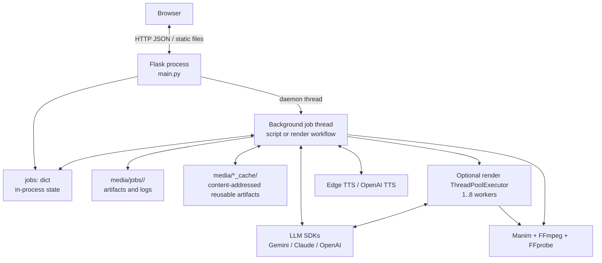
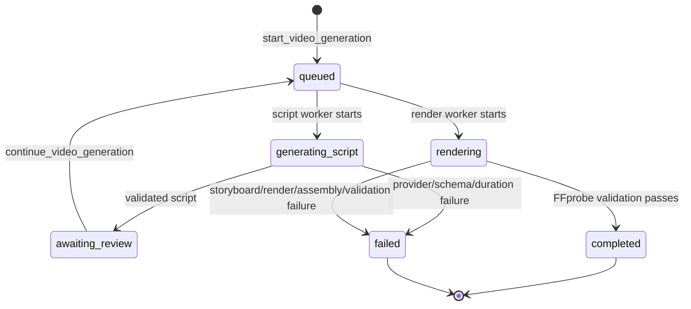
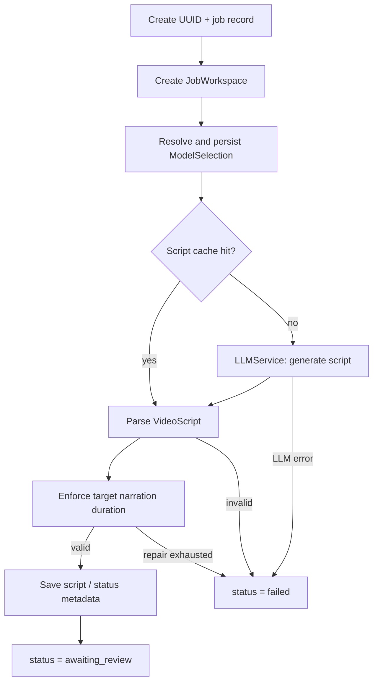
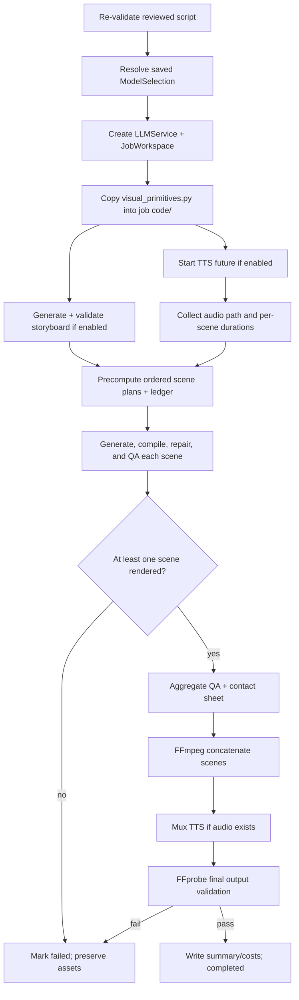
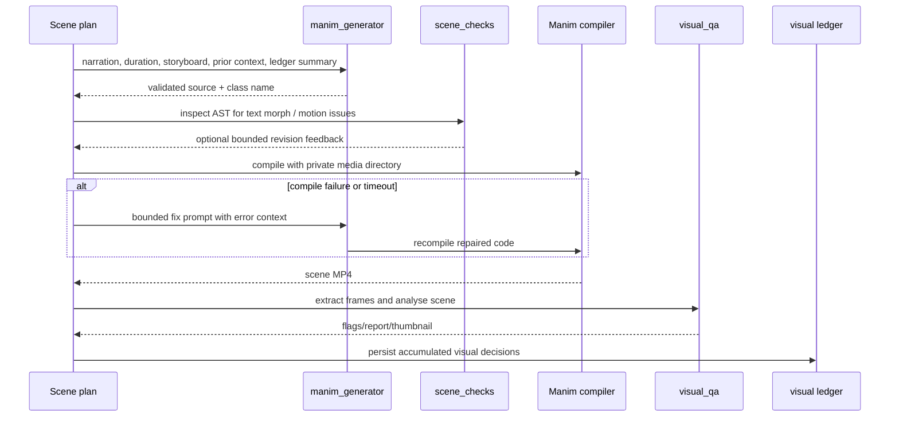

# Prompt2Learn.ai (P2L.ai) — Low-Level Design Notes

## 1. Purpose and scope

This document describes the current implementation of Prompt2Learn.ai at the
module, data-contract, and workflow level. It is a maintenance reference for
engineers working on the Flask application, the LLM/Manim pipeline, or the
browser UI.

The high-level architecture is described in [HLD.md](HLD.md). This document
focuses on implementation behavior and invariants rather than future platform
architecture.

## 2. Runtime topology



### Process model

- Flask runs with `threaded=True` and `use_reloader=False`.
- Script creation and rendering each execute in daemon background threads.
- The registry is the module-global `jobs: dict` in `video_generator.py`.
- There is no database, inter-process queue, authentication, or persistence of
  active state. A restart loses `jobs`, but files already written under `media/`
  remain available.
- `app_build.py` computes a source fingerprint at import time. `POST
  /api/generate` rejects new work with HTTP 503 if source files changed after
  process start, because auto-reload is deliberately disabled.

## 3. Source ownership map

| File | Main responsibility | Important entry points |
| --- | --- | --- |
| `src/main.py` | HTTP transport and static/media serving | `generate_video`, `continue_video`, `get_progress`, `health_check` |
| `src/video_generator.py` | Job lifecycle and pipeline orchestration | `start_video_generation`, `generate_script_workflow`, `generate_rendering_workflow` |
| `src/config.py` | Environment-backed configuration/model routing | `resolve_model_selection`, `get_retry_policy`, `get_visual_config` |
| `src/llm_service.py` | Provider calls, retries, cooldowns, usage | `LLMService` |
| `src/animations.py` | Script prompts and duration repair | `generate_script` |
| `src/schemas.py` | Validation and parsing contracts | `parse_script`, `parse_storyboard`, `parse_manim_code` |
| `src/storyboard.py` | Visual-direction generation and diversity validation | `generate_storyboard`, `check_diversity` |
| `src/domain_guidance.py` | Closed domain-tag taxonomy and prompt fragments | `normalize_tags`, `build_domain_section` |
| `src/manim_generator.py` | Scene and repair prompts | `generate_manim_code`, `fix_manim_code` |
| `src/scene_checks.py` | AST-level gates for generated scene code | `check_scene_motion`, `build_text_morph_feedback` |
| `src/tts_generator.py` | TTS generation and audio concat | `generate_complete_audio` |
| `src/concat_video.py` | Manim invocation and scene concat/mux wrappers | `compile_video`, `concatenate_videos`, `merge_video_and_audio` |
| `src/ffmpeg_utils.py` | FFmpeg command construction and output validation | `validate_output`, `probe_media` |
| `src/media_paths.py` | Stable filesystem layout and cache locations | `JobWorkspace` |
| `src/visual_qa.py` | Frame extraction and heuristic visual QA | `analyze_scene`, `build_contact_sheet` |
| `src/visual_ledger.py` | Cross-scene anti-repetition history | `VisualLedger` |
| `src/frontend/app.js` | Client-side submission, polling, review, and video display | browser event handlers and polling loop |

## 4. HTTP contracts

### `POST /api/generate`

Creates a job and starts script generation.

```json
{
  "topic": "Explain the cosine rule",
  "llm_provider": "auto",
  "enable_tts": true,
  "tts_provider": "edge-tts",
  "tts_voice": "en-US-AriaNeural",
  "tts_rate": "+0%",
  "bypass_cache": false,
  "bypass_scene_cache": false,
  "target_duration": 60
}
```

| Response | Meaning |
| --- | --- |
| `202` | Job accepted: `{ job_id, status: "queued" }`. |
| `400` | Missing `topic`. |
| `503` | Source fingerprint is stale; restart the server first. |
| `500` | Unexpected request handling failure. |

`target_duration` is validated and clamped to the schema range of 5–600 seconds.

### `POST /api/generate/continue`

Continues a job only when its status is `awaiting_review`.

```json
{
  "job_id": "uuid",
  "video_data": [
    {
      "chapter": "Cosine rule",
      "text": "...",
      "animation": "...",
      "objective": "...",
      "explanation": "...",
      "duration": 8.0
    }
  ]
}
```

| Response | Meaning |
| --- | --- |
| `200` | Render workflow queued. |
| `404` | Unknown job or job not awaiting review. |
| `500` | Unexpected request handling failure. |

The rendering workflow validates `video_data` again; browser-side edits are
never trusted as already-valid data.

### `GET /api/progress/<job_id>?since=<seq>`

Returns the job state. With `since`, `messages` includes only activity entries
whose sequence number is greater than `since`.

```json
{
  "job_id": "uuid",
  "status": "awaiting_review",
  "progress": 25,
  "current_step": "script",
  "message": "Script ready for review",
  "message_seq": 14,
  "messages": [{"seq": 14, "ts": "ISO-8601", "text": "..."}],
  "metadata": {},
  "video_url": null,
  "error": null,
  "error_category": null
}
```

The server caps the stored activity feed at 2,000 messages per job.

### Other routes

| Route | Behavior |
| --- | --- |
| `GET /` | Serves `src/frontend/index.html`. |
| `GET /api/health` | Returns service metadata and `build.stale`. |
| `GET /media/<path>` | Serves paths rooted at the project `media/` directory. |

## 5. Core data contracts

### Scene and script schema

`schemas.Scene` contains the minimum educational contract:

| Field | Type | Validation |
| --- | --- | --- |
| `chapter` | string | Required, non-empty, ≤4,000 chars. |
| `text` | string | Required narration, non-empty, ≤2,000 chars. |
| `animation` | string | Required, non-empty, ≤4,000 chars. |
| `objective` | string | Required, non-empty, ≤4,000 chars. |
| `explanation` | string | Required, non-empty, ≤4,000 chars. |
| `duration` | number/null | `null` for absent/non-positive; otherwise 0.5–60 seconds. |

`VideoScript` requires 1–40 ordered scenes. Input whitespace is normalized
without destroying newlines, and mojibake is repaired before text reaches TTS
or the screen.

### Manim response schema

`ManimCode` requires:

```json
{
  "content": "complete Python / Manim source with a class definition",
  "class_name": "ValidPythonIdentifier",
  "fix_explanation": "optional repair note"
}
```

The class name must be a valid Python identifier. Raw LLM JSON is parsed only
through `parse_manim_code_from_text` before compilation.

### Storyboard contract

Storyboard validation adds visual-direction fields around every script scene,
including visual metaphor, composition, objects, primary motion, camera plan,
transition, on-screen text, visual complexity, domain tags, dimension, scene
kind, narrative role, ending state, continuity notes, and semantic colours.

The domain taxonomy is closed. Unknown tags are rejected during schema parsing;
missing or unusable guidance falls back to `general`.

### Internal job record

The job record is a mutable dictionary. Important fields are:

| Field | Written by | Purpose |
| --- | --- | --- |
| `job_id`, `topic`, `created_at`, `updated_at` | job creation/status updates | Identity and timing. |
| `status`, `progress`, `current_step` | workflow/status updates | UI lifecycle state. |
| `message`, `messages`, `message_seq` | `update_job_status` | Current message and incremental activity feed. |
| `video_data` | script workflow / continuation | Reviewed scene data. |
| `metadata` | all workflow stages | Safe UI-facing artifact, quality, cost, and model data. |
| `_model_selection` | `_job_selection` | Internal canonical `ModelSelection`; not an API contract. |
| `model_audit` | `_job_selection` | Persistent safe record of provider/model routing. |
| `video_url`, `error`, `error_category` | final/failure stages | User-visible terminal result. |

## 6. Job state and transition rules



The pipeline uses status strings opportunistically with richer detail in
`current_step`, messages, and metadata. Consumers should not infer workflow
progress solely from a single status string; use `progress`, `current_step`, and
the activity feed together.

## 7. Script-generation workflow

`generate_script_workflow(...)` is started by `start_video_generation(...)`.



Key implementation rules:

- `resolve_model_selection` runs once per job. The result is reused after
  review, so a job cannot switch provider/model between script and rendering.
- Explicit UI selection implies strict mode unless `LLM_ALLOW_FALLBACK=true`.
- Script caching is content-addressed and bypassable per request.
- Script duration is checked from narration pace and repaired in a controlled
  pass if necessary.
- Failure messages include provider/model, error category, strict-mode state,
  and a job-log path.

## 8. Rendering workflow

`generate_rendering_workflow(job_id)` begins after a reviewed script is posted.



### Parallelism and ordering

- TTS and storyboard generation start in parallel because both depend only on
  the reviewed script.
- Scene plans are prepared in scene order before rendering. This preserves
  previous-scene context and allows the visual ledger to detect repetition only
  against prior scenes.
- Rendering can use `RENDER_WORKERS` workers (bounded to 1–8). Completion order
  may differ from scene order.
- Results are reassembled by original scene index before concatenation.
- Each render receives `JobWorkspace.scene_media_dir(index)`, preventing Manim
  text/image cache races between concurrent processes.

### Scene processing sequence



## 9. LLM routing, reliability, and usage accounting

### Model roles

| Role | Used for |
| --- | --- |
| `script` | Initial structured script generation and script repair. |
| `storyboard` | Visual-direction generation; defaults to animation model if unset. |
| `animation` | Per-scene Manim source generation. |
| `repair` | Manim compile/revision repair. |
| `fallback` | Optional in-provider fallback in non-strict mode. |

`auto` selects the first configured provider in the supported preference order.
A concrete Gemini UI choice overrides the script model; a strict explicit choice
uses the selected model across roles unless the fallback override is enabled.

### Retry policy

Gemini uses one bounded policy with configurable attempts, exponential delay,
jitter, cooldown after repeated quota failures, maximum concurrency, optional
fallback, and a finite HTTP deadline. The default HTTP timeout is 120,000 ms;
this prevents a hung SDK call from bypassing the application’s retry logic.

### Cost data

LLM usage is logged as structured `llm_usage` records in `logs/job.log`. TTS
usage is recorded from characters actually synthesized. `_aggregate_cost_report`
reads those records and reports measured token/character totals and calculated
costs; it deliberately returns zero data rather than invented estimates when
there is no successful usage record.

## 10. Filesystem design

### Job workspace

```text
media/jobs/<job_id>/
├── audio/
│   ├── fragment_<index>.mp3
│   ├── audio_concat.txt
│   └── narration.m4a
├── code/
│   ├── scene_<index>.py
│   └── visual_primitives.py
├── scenes/
│   └── scene_<index>.mp4
├── video/
│   ├── scene_<index>/          # private Manim --media_dir
│   ├── concat_list.txt
│   └── silent.mp4
├── logs/
│   ├── job.log                 # JSON Lines
│   ├── manifest.json
│   ├── storyboard.json
│   ├── visual_ledger.json
│   └── scene_<index>_timing.json
├── qa/
│   ├── frame_<scene>_<sample>.png
│   ├── thumb_<scene>.png
│   ├── contact_sheet.png
│   └── visual_qa.json
└── final/
    └── output_<job_id>.mp4
```

### Shared caches

`media/script_cache`, `media/scene_cache`, and `media/tts_cache` are outside
job directories. Cache identities include `CACHE_VERSION` and relevant input,
provider/model, scene context, duration, and visual-direction settings. The
current cache version is `v3`; increment it whenever cache shape or key
semantics change.

## 11. Validation and quality gates

| Stage | Gate | Failure behavior |
| --- | --- | --- |
| Script response | `VideoScript` Pydantic parse | Error or controlled script repair; job fails if unrecoverable. |
| Reviewed script | Parse again before rendering | Job fails as `invalid_output`. |
| Storyboard | Pydantic parse + diversity checks | Controlled repair; fails loudly if storyboard remains unavailable while enabled. |
| Manim response | `ManimCode` parse | Scene failure or repair path. |
| Static scene analysis | AST inspection | At most one targeted revision for text-morph/motion issues. |
| Manim compile | Bounded timeout, dimension-aware allowance | Per-scene repair; preserved failure report. |
| Visual output | Frame and temporal QA | Flags reported; blank-render repair is bounded. |
| Final output | FFprobe streams/duration checks | Job fails; intermediate artifacts remain. |

Visual QA is advisory except for the configured blank-scene repair trigger. It
does not silently remove scenes from the output.

## 12. Configuration reference

| Group | Representative environment variables | Effect |
| --- | --- | --- |
| LLM keys | `GEMINI_API_KEY`, `CLAUDE_API_KEY`, `OPENAI_API_KEY` | Enables a provider. |
| Models | `GEMINI_SCRIPT_MODEL`, `GEMINI_ANIMATION_MODEL`, `GEMINI_REPAIR_MODEL`, `GEMINI_STORYBOARD_MODEL` | Assigns model roles. |
| LLM resilience | `GEMINI_RETRY_ATTEMPTS`, `GEMINI_MAX_CONCURRENCY`, `GEMINI_HTTP_TIMEOUT_MS`, `LLM_FALLBACK_ENABLED` | Bounds retry, timeout, concurrency, and fallback. |
| TTS | `TTS_PROVIDER`, `TTS_MODEL`, `VOICE`, `EDGE_TTS_RATE` | Controls narration synthesis. |
| Cache | `SCRIPT_CACHE_ENABLED`, `SCENE_CACHE_ENABLED`, `TTS_CACHE_ENABLED` | Enables reusable artifacts. |
| Visual direction | `STORYBOARD_ENABLED`, `GLOBAL_VISUAL_STYLE`, `VISUAL_REPAIR_ATTEMPTS` | Controls planning and scene repair. |
| Render/QA | `MANIM_QUALITY`, `RENDER_WORKERS`, `QA_*` | Controls render cost/quality and heuristic thresholds. |
| Service | `PORT` | Flask port. |

Use `.env.example` as the full operator reference. Never log or commit API keys.

## 13. Failure model

### Error categories

The pipeline exposes an `error_category` alongside user-readable error text.
Common categories include provider/model availability, invalid output,
render/FFmpeg failure, and an `other` fallback for unexpected exceptions.

### Failure behavior by subsystem

| Subsystem | Behavior |
| --- | --- |
| No usable provider/model | Fail early with configuration context. |
| Script provider failure | Fail the job; preserve routing/audit log. |
| Storyboard failure | Fail when storyboard is enabled; visual direction is not silently skipped. |
| TTS failure | Continue without audio when possible; record TTS status as failed. |
| Individual scene failure | Collect failure diagnostics; continue other scenes where possible. |
| All scenes fail | Mark job failed. |
| Scene concat failure | Mark job failed and retain intermediates. |
| Audio mux failure | Copy silent video and continue final validation without expected audio. |
| Final validation failure | Mark job failed and retain artifacts for inspection. |

## 14. Testing map

The test suite is organized around contracts and regression risks rather than
live paid calls. Notable coverage includes:

| Test area | Examples |
| --- | --- |
| Schemas/duration | `test_schemas.py`, `test_script_duration.py` |
| Provider selection/reliability | `test_config.py`, `test_llm_service.py`, `test_strict_model_selection.py`, `test_stall_fixes.py` |
| Domain/storyboard quality | `test_domain_routing.py`, `test_storyboard.py`, `test_scene_kind.py`, `test_narrative_arc_and_continuity.py` |
| Rendering isolation/assembly | `test_render_isolation.py`, `test_rendering_pipeline_regression.py`, `test_ffmpeg_utils.py` |
| Visual quality | `test_visual_qa.py`, `test_visual_ledger.py`, `test_scene_checks.py` |
| Concurrency/performance | `test_perf_concurrency.py`, `test_perf_and_graph_motion.py` |

Run with `python -m pytest` once a valid Python environment has been restored.
The current checked-in virtual environment may point to a removed interpreter,
so recreate it with the project’s supported Python/`uv` workflow if needed.

## 15. Non-negotiable maintenance invariants

1. Parse every LLM payload through its Pydantic schema before use.
2. Preserve the saved `ModelSelection` for every stage of a job.
3. Never share a Manim `--media_dir` between concurrently rendering scenes.
4. Maintain scene order for final concatenation even when rendering in parallel.
5. Do not silently disable storyboard direction or silently downgrade an
   explicit model choice.
6. Keep retries, repairs, timeouts, and concurrency bounded.
7. Preserve failed job assets and diagnostics; they are the primary debugging
   evidence for expensive render failures.
8. Validate final media with FFprobe before reporting `completed`.
9. Restart the server after source edits; the stale-build check exists because
   auto-reload intentionally remains disabled.
10. Do not commit API keys or other secrets.

## 16. Known implementation limitations

- Job state is not durable or shared across processes.
- Generated Python is compiled by Manim in the application environment; a
  public multi-tenant deployment needs process/container sandboxing, resource
  quotas, and filesystem/network isolation.
- Media artifacts have no automatic retention or cleanup policy.
- Media routes are unauthenticated.
- Job registry mutation is simple in-process shared state; a durable queue and
  transactional state model are required before horizontal scale.
