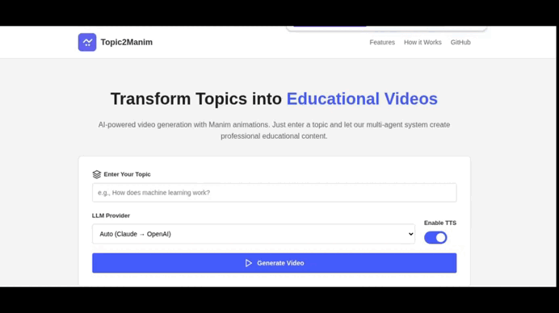
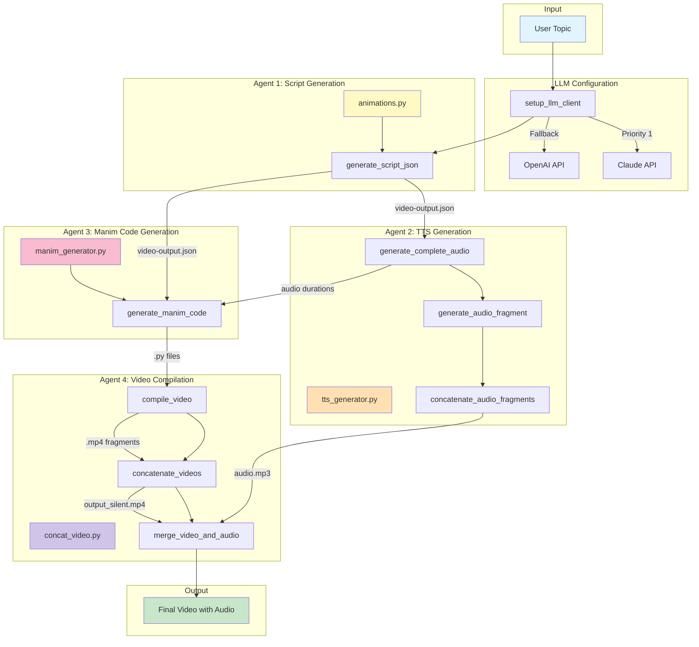

<div align="center">


# Prompt2Learn.ai

</div>

Automatic educational video generator using AI and Manim. Converts any topic into a professional animated video with narration and mathematical visualizations.

<div align="center">
  
## User Interface



</div>

<div align="center">
  
## Examples

</div>

> propmt: How do machines learn to recognize MNIST dataset numbers?
> 
> model: claude-sonnet-4-5-20250929
> 
> response:

<div align="center">


</div>

> propmt: What is a Markov chain and how are they related to LLMs?
> 
> model: claude-sonnet-4-5-20250929
> 
> response:

<div align="center">


</div>

> propmt: How does Cramer's rule work for system of linear equations?
> 
> model: claude-sonnet-4-5-20250929
> 
> response:

<div align="center">


</div>

> propmt: how chat gpt works?
> 
> model: gpt-5.2
> 
> response:

<div align="center">


</div>

> propmt: how tokenization works in chat gpt?
> 
> model: gpt-5.2
> 
> response:

<div align="center">


</div>

## Features

- **Visual-direction system** — a validated per-video **storyboard** directs every
  scene (unique metaphor, composition, motion, color role, transition), a
  **visual ledger** prevents repetition, and diversity rules enforce genuinely
  distinct scenes (≥5 for 60s, ≥8 for 120s). Scenes stay bespoke — no fixed
  template library.
- **Visual QA artifacts** — per-scene frame extraction, a per-job **contact
  sheet**, and heuristic quality flags (blank/white/low-variance/edge-clipping/
  no-change/near-identical/text-only/repeated-layout). Flags are advisory and
  recorded for review; they never silently drop scenes.
- **Scene-level visual repair** — a blank render regenerates only that one scene
  (configurable, default 1 attempt); the rest of the video is untouched.
- **Multi-LLM Support** with automatic fallback (Gemini, Claude, OpenAI)
- **First-class Gemini support** with role-based model routing (a fast model for
  scripts, a high-quality model for storyboard + Manim animation code)
- **Resilient Gemini calls**: SDK-native exponential backoff + jitter, per-model
  cooldown after repeated 429s, bounded concurrency, and configurable fallback —
  no silent quality downgrades
- **Pydantic-validated** script/scene JSON with a single controlled repair pass
- **Per-job asset isolation** under `media/jobs/<job_id>/` (no cross-job collisions)
- **FFmpeg-based** audio concatenation, video concatenation, and muxing with an
  **FFprobe validation gate** before a job is marked complete
- **Educational animations** with Manim Community Edition
- **Eight explanation modes** — preserve the existing balanced `general` flow or
  choose conceptual intuition, worked example, visual proof, graphical
  exploration, exam technique, misconception repair, or revision recap.
- **Optional AQA A-level Mathematics profile** — adds AQA 7357 terminology,
  mathematical reasoning, problem-solving, modelling, and visual-accuracy
  guidance without changing the default general-purpose behavior.
- **Multi-language support** (automatically detects topic language)

## Requirements

- Python 3.10+
- **FFmpeg and FFprobe** on `PATH` (required for audio/video assembly and output
  validation). Verify with `ffmpeg -version` and `ffprobe -version`.
- Manim Community Edition system dependencies (Cairo, Pango) — installed
  automatically via `uv sync` / the Docker image.
- At least one LLM API key (Gemini, Claude, or OpenAI).

## Configuration

Copy `.env.example` to `.env` and configure at least one provider. Key settings:

| Variable | Purpose |
| --- | --- |
| `GEMINI_API_KEY` / `GOOGLE_API_KEY` | Gemini access |
| `CLAUDE_API_KEY`, `OPENAI_API_KEY` | Claude / OpenAI access (OpenAI also powers OpenAI TTS) |
| `GEMINI_SCRIPT_MODEL` | Fast model for script + scene JSON |
| `GEMINI_ANIMATION_MODEL` | High-quality model for Manim code (e.g. Gemini 3.6 Flash) |
| `GEMINI_REPAIR_MODEL` | Model used to repair invalid JSON / failed compiles |
| `GEMINI_FALLBACK_MODEL` | Used only after the selected model's retries/cooldown; blank disables |
| `GEMINI_RETRY_ATTEMPTS`, `GEMINI_RETRY_INITIAL_DELAY`, `GEMINI_RETRY_MAX_DELAY` | Bounded retry tuning (single SDK retry system) |
| `GEMINI_COOLDOWN_THRESHOLD`, `GEMINI_COOLDOWN_SECONDS` | Cooldown after repeated 429s |
| `GEMINI_MAX_CONCURRENCY` | In-process concurrency limit for Gemini calls |
| `LLM_FALLBACK_ENABLED` | Toggle automatic in-provider fallback |
| `TTS_PROVIDER`, `TTS_MODEL`, `VOICE`, `EDGE_TTS_RATE` | Narration settings |
| `SCRIPT_CACHE_ENABLED`, `SCENE_CACHE_ENABLED`, `TTS_CACHE_ENABLED` | Content-addressed caches |
| `GEMINI_STORYBOARD_MODEL` | Model for the visual-direction pass (blank → animation model) |
| `STORYBOARD_ENABLED` | Master toggle for the storyboard pass |
| `VISUAL_REPAIR_ATTEMPTS` | Max scene-level visual repairs for a blank render (default 1) |
| `CONTACT_SHEET_ENABLED`, `VISUAL_QA_ENABLED` | Contact sheet + heuristic QA report |
| `GLOBAL_VISUAL_STYLE` | Override the global visual style contract (blank → default) |
| `MANIM_QUALITY` | `low` (480p15, fast) \| `medium` (720p30) \| `high` (1080p60) |
| `QA_*` (see `.env.example`) | Visual-QA heuristic thresholds |
| `PORT` | App port (must match Docker `EXPOSE` / compose mapping) |

> Gemini model IDs are placeholders in the defaults — set the exact model names
> your Google account can access. Never commit real API keys.

## Visual-direction system

Every video is planned before any Manim code is written:

1. **Storyboard pass** — after the script is validated, one LLM request (using the
   strongest configured model) produces a Pydantic-validated `Storyboard`: a global
   style contract plus, per scene, a learning goal, key concept, unique visual
   metaphor, composition, primary objects, primary motion, color role, camera plan,
   transition-from-previous, on-screen text, anti-repetition notes, and visual
   complexity. Saved to `logs/storyboard.json`.
2. **Diversity enforcement** — the storyboard must provide enough distinct visual
   approaches (≥5 for 60s, ≥8 for 120s), avoid adjacent metaphor/layout repeats,
   and not reuse a layout more than twice. A violated storyboard is repaired once;
   residual notes are recorded (never fatal).
3. **Visual ledger** — as scenes render, used metaphors/layouts/objects/colors/
   motions/transitions accumulate (`logs/visual_ledger.json`). Each scene prompt
   receives its storyboard entry, the global style, a compact previous-scene
   summary, and the compact ledger — plus explicit "do not repeat" instructions.
   Full prior source code is never re-sent.
4. **Optional primitives** — `src/visual_primitives.py` offers low-level building
   blocks (styled text, nodes/edges, chips, bars, safe layout/framing, transitions)
   the model *may* import. They compose into bespoke scenes; they are not fixed
   templates.
5. **Visual QA** — representative frames are extracted per scene, analysed
   (Pillow + numpy), assembled into `qa/contact_sheet.png`, and flagged
   (`qa/visual_qa.json`). A blank render triggers one scene-level visual repair.

### Where to find a job's artifacts

For job `<job_id>` (all served under `/media/...`):

| Artifact | Path |
| --- | --- |
| Storyboard | `media/jobs/<job_id>/logs/storyboard.json` |
| Visual ledger | `media/jobs/<job_id>/logs/visual_ledger.json` |
| Contact sheet | `media/jobs/<job_id>/qa/contact_sheet.png` |
| Visual QA report | `media/jobs/<job_id>/qa/visual_qa.json` |
| Per-scene frames | `media/jobs/<job_id>/qa/frame_*.png` |
| Final MP4 | `media/jobs/<job_id>/final/output_<job_id>.mp4` |

Their URLs are also surfaced in the job status `metadata` (and logged in the UI).

## Explanation modes

The existing behavior remains the default:

```json
{
  "topic": "Explain Newton-Raphson iteration",
  "explanation_mode": "general",
  "curriculum_profile": "general"
}
```

For an AQA-focused graphical lesson, send:

```json
{
  "topic": "Explain Newton-Raphson iteration and when it can fail",
  "target_duration": 90,
  "explanation_mode": "graphical_exploration",
  "curriculum_profile": "aqa_a_level_mathematics"
}
```

Valid `explanation_mode` values are:

- `general`
- `conceptual_intuition`
- `worked_example`
- `derivation_visual_proof`
- `graphical_exploration`
- `exam_technique`
- `misconception_repair`
- `revision_recap`

Valid `curriculum_profile` values are `general` and
`aqa_a_level_mathematics`. These values are part of both the script and scene
cache keys, so one teaching approach can never reuse another approach's output.
The choices are also stored in the job manifest and returned by the generation
API.

## Per-job media layout

Each generation job writes to an isolated workspace:

```
media/jobs/<job_id>/
  audio/    TTS fragments + final narration (narration.m4a)
  scenes/   rendered per-scene mp4s
  code/     generated Manim .py source
  video/    concat manifests + silent concat output
  logs/     job logs + manifest
  final/    final muxed mp4  (served at /media/jobs/<job_id>/final/output_<job_id>.mp4)
```

Reusable content-addressed caches (`media/script_cache`, `media/scene_cache`,
`media/tts_cache`) live outside the job trees and are keyed by model/settings/input
plus a `CACHE_VERSION`.

## Testing

```bash
uv pip install pytest    # or: pip install pytest
python -m pytest         # 89 unit tests; no live API/paid calls
```

## Troubleshooting

**Gemini 429 / `RESOURCE_EXHAUSTED`** — the app retries with backoff (SDK), then
cools the model down and, if configured, falls back to `GEMINI_FALLBACK_MODEL`.
Reduce `GEMINI_MAX_CONCURRENCY`, raise `GEMINI_COOLDOWN_SECONDS`, or switch
`GEMINI_SCRIPT_MODEL` to a higher-quota model. Job status exposes the selected
model, cooldown state, and fallback reason.

**Gemini 503 / overload / timeout** — handled as transient by the SDK retry
policy; persistent failures fall back (if configured) or fail the job with a safe
message while preserving assets.

**Final video failed validation** — the job is marked failed with the reason
(e.g. missing audio stream, zero duration, duration out of tolerance). Inspect the
preserved assets under `media/jobs/<job_id>/` (`video/silent.mp4`, `audio/`,
`code/`). Ensure FFmpeg/FFprobe are installed and on `PATH`.

**Scenes look repetitive or flagged** — open `qa/contact_sheet.png` and
`qa/visual_qa.json` for the job. Flags (`likely_repeated_layout`,
`text_only_scene`, `near_identical_to_previous_scene`, …) are advisory. To push
more variety, ensure `STORYBOARD_ENABLED=true`, use a stronger
`GEMINI_ANIMATION_MODEL`/`GEMINI_STORYBOARD_MODEL`, and regenerate with the
scene-cache bypass. A `blank_or_black` flag auto-triggers one scene-level visual
repair (`VISUAL_REPAIR_ATTEMPTS`).

## Architecture

### System Overview

Prompt2Learn.ai is a multi-agent system that orchestrates several specialized components to transform a topic into an educational video. The system follows a pipeline architecture where each agent has a specific responsibility.



## Installation

First, install uv (if you haven't already):

```bash
# On macOS and Linux
curl -LsSf https://astral.sh/uv/install.sh | sh

# Or using pip
pip install uv
```

### Setup

```bash
git clone https://github.com/mateolafalce/prompt2learn.ai.git
cd prompt2learn.ai

# Create virtual environment and install all dependencies
uv sync

# Activate the virtual environment
source .venv/bin/activate  # On Windows: .venv\Scripts\activate

cp .env.example .env
```

## Usage

Start the Flask server:

```bash
python run.py
```

`run.py` automatically re-runs with `.venv\Scripts\python.exe` when the
project virtual environment exists, so Flask is loaded from the project's
installed dependencies.

On Windows, if `python` is not on PATH, use:

```bash
py run.py
```

You can also invoke the virtual environment directly:

```powershell
.venv\Scripts\python.exe run.py
```

Equivalent npm-style shortcut:

```bash
npm run dev
```

`npm run dev` only delegates to the Python/Flask server; npm is not used to
build the frontend. It runs the same launcher as `python run.py`.

Restart the command after Python source changes because the
server intentionally disables Flask's auto-reloader to preserve long-running
job state.

Then open your browser and navigate to:
```
http://localhost:5000
```

### Reliability and recovery

- `GET /api/health` reports Python package, FFmpeg/FFprobe, Manim, API-key,
  and source-build readiness. Generation fails early with
  `environment_not_ready` when required dependencies are missing.
- Every job continuously writes an atomic state snapshot to
  `media/jobs/<job_id>/logs/manifest.json`.
- Generated Manim payloads are checked for valid Python syntax, a Manim import,
  and the declared `Scene` subclass before rendering.
- `POST /api/generate/retry` retries a failed reviewed job. Successful TTS and
  scene artifacts are reused through the content-addressed caches.
- Job metadata exposes `stage_seconds`, `cache_stats`, provider usage, token
  counts, TTS characters, and estimated cost.
- The review studio remains the approval gate before TTS, storyboard generation,
  Manim rendering, and FFmpeg assembly begin.

or 

```bash
docker compose up
```


